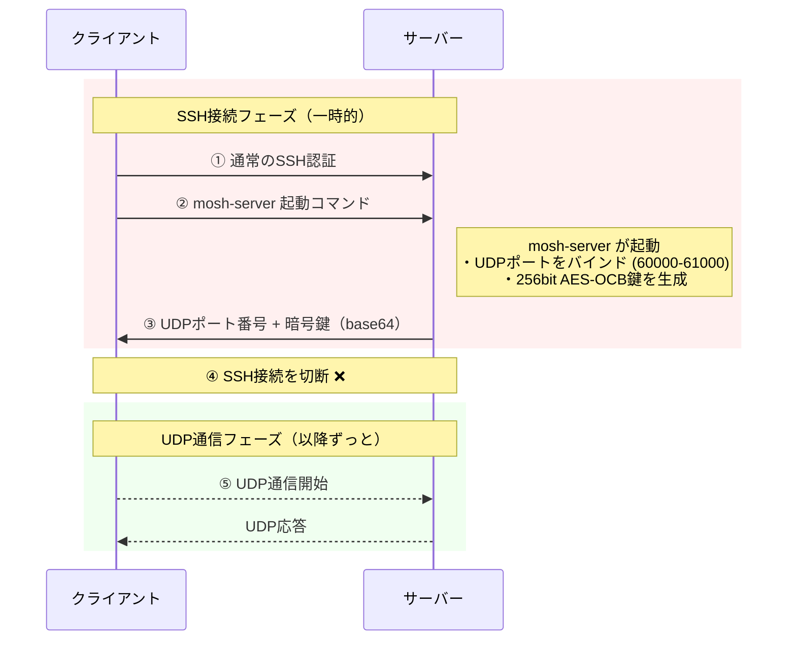
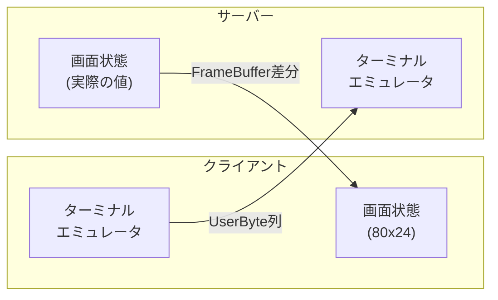
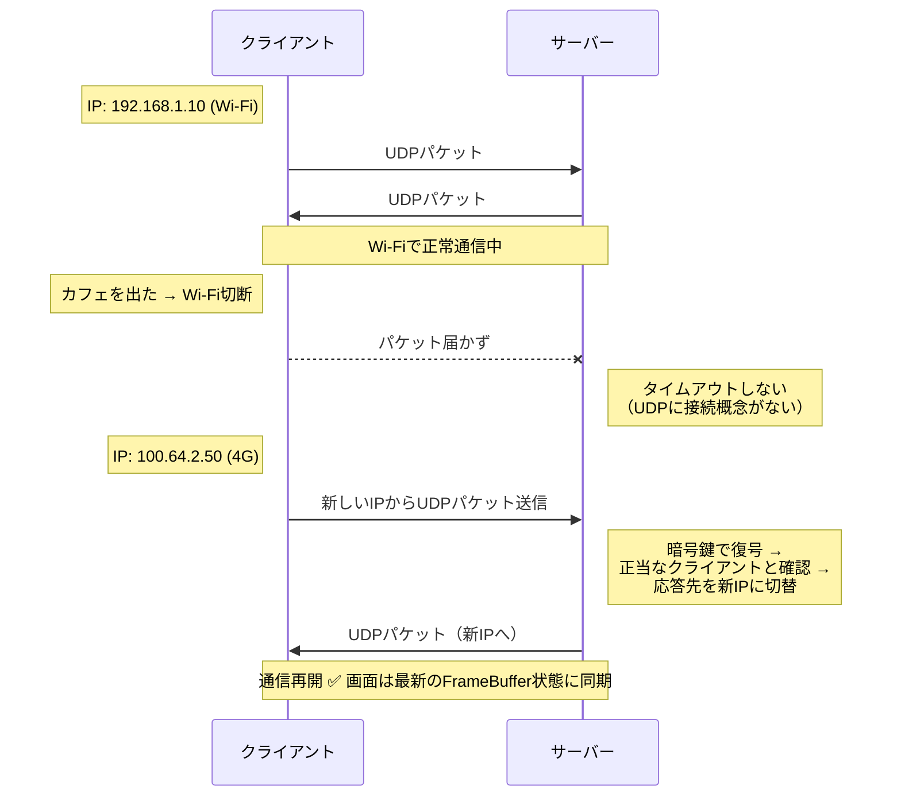
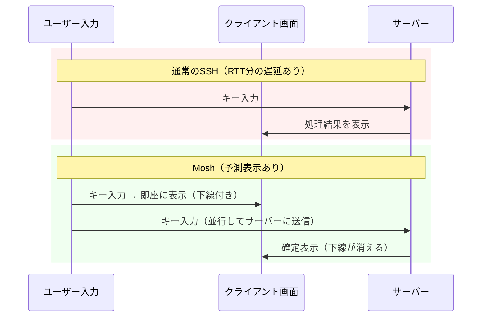

# Moshプロトコルを理解する — モバイル時代のリモートターミナル

SSHは強力なリモートアクセスプロトコルですが、モバイル環境では「接続が切れる」問題から逃れられません。Mosh（Mobile Shell）は、SSHの制約をプロトコルレベルで根本的に回避する設計になっています。

この記事では、MoshがどのようにSSHの弱点を克服しているのかを、プロトコルの仕組みから解説します。SSHの基礎知識については前回の記事を参照してください。

👉 [SSHプロトコルを理解する — 仕組みから学ぶセキュア通信の基礎](ssh-protocol-article.md)

## SSHがモバイル環境で破綻する理由

SSHの仕組みを踏まえると、モバイル環境で弱い理由が明確になります。

1. **TCP 4タプルの制約**: IPが変わると接続が別物になり、ハンドシェイクを最初からやり直す必要がある
2. **ステートフルな暗号化**: シーケンス番号ベースでMAC/暗号化を行うため、パケットが1つでも失われるとストリーム全体が壊れる
3. **TCPの再送タイムアウト**: パケットロスが続くとTCPの再送間隔が指数的に増大（最大60秒以上のタイムアウト）
4. **キープアライブの限界**: `ServerAliveInterval` を設定しても、ネットワーク切替時には間に合わない

MoshはSSHのこれらの制約を根本的に回避する設計になっています。

## 初回ブートストラップ — SSHからUDPへの移行

Moshの接続開始時、実はSSHを使います。ただしSSHを使うのはこの一瞬だけです。



SSHは鍵をセキュアに渡すためのブートストラップとしてのみ使われ、実際のターミナル通信はUDPに完全移行します。

## UDP — なぜ「接続」が切れないのか

UDPのパケット（データグラム）構造を見てみます。

| UDPパケット | サイズ |
|-------------|--------|
| 送信元ポート | 2 bytes |
| 宛先ポート | 2 bytes |
| データ長 | 2 bytes |
| チェックサム | 2 bytes |
| ペイロード（Moshのデータ） | 可変長 |

ヘッダはわずか8バイト（TCPは最低20バイト）。シーケンス番号もACKもありません。

TCPと比較したときの決定的な違い：

- **接続状態を持たない（コネクションレス）**: 各パケットが独立しており、「接続」という概念がない
- **順序保証なし**: パケットが順番通り届く保証がない（Mosh側で対処する）
- **到達保証なし**: パケットが届かなくてもプロトコル層では何もしない
- **ハンドシェイク不要**: いきなりデータを送れる

「接続」がないということは、**送信元IPが変わっても「接続が切れる」ことが原理的に起こらない**。サーバー側は「正しい暗号鍵で復号できるパケットが届いた」ことだけを確認すればよく、それがどのIPアドレスから来たかは気にしません。

## Moshの暗号化 — AES-128-OCB

MoshはAES-128-OCB（Offset Codebook Mode）で暗号化を行います。

| Mosh UDPデータグラム | サイズ | 説明 |
|---------------------|--------|------|
| nonce | 8 bytes | パケットごとにユニークな番号。シーケンス番号 + 方向ビットで構成 |
| 暗号文 + 認証タグ | 可変長 | OCBで一体生成。ターミナル状態の差分データを暗号化し、改竄検知も1パスで実行 |

OCBモードの選択は意図的です：

| 特性 | OCBモード | GCMモード（SSH等で使用） |
|------|-----------|----------------------|
| 暗号化+認証のパス数 | 1パス | 2パス |
| レイテンシ | 低い | やや高い |
| 特許 | 2021年に無料化 | もともと無料 |
| パケット単位での処理 | 適している | 適している |

UDPは各パケットが独立しているため、パケット単位で暗号化・復号できるOCBモードが合理的です。パケットが途中で失われても、後続パケットの復号には影響しません（SSHのストリーム暗号方式との決定的な違い）。

nonceにはシーケンス番号が使われるため、**リプレイ攻撃（古いパケットを再送する攻撃）も検知できます**。

## SSP（State Synchronization Protocol）

Moshの中核がSSP — 画面の「状態」を同期するプロトコルです。SSHが「入力バイト列をそのまま転送」するのに対して、Moshは「画面がどう見えるべきか」を同期します。



SSPの同期ルール：

- 各フレームに通し番号（epoch）を付与
- サーバー → クライアントに「最新の画面状態」を送信
- クライアントは最後に受信した番号をACKとして返す
- サーバーはACKされていない最新状態を再送
- 順序逆転やパケットロスがあっても、常に「最新の状態」だけを適用

従来のSSHとの違いを具体例で説明すると：

**SSHの場合**: `ls -la` の出力が100行ある場合、100行分のバイト列を順番通り送る必要がある。途中の1パケットが失われるとTCPの再送を待つことになり、画面表示が止まる。

**Moshの場合**: `ls -la` の出力後の「画面の最終状態」（80×24の文字グリッド）を送る。途中のパケットが失われても、次のパケットで最新の画面状態が届けば問題ない。古い中間状態はスキップされる。

## ローミング — IPアドレス変更への対応



認証は暗号鍵ベースなので、IPアドレスが何回変わろうと、正しい鍵でパケットを暗号化できている限り通信は継続します。再認証は不要です。

## ローカルエコーと予測表示

Moshのもう一つの特徴が、入力の予測表示です。



クライアント側にもターミナルエミュレータが組み込まれており、入力文字を即座に表示します。予測中の文字は下線付きで表示され、サーバーから実際の結果が返ってくると確定表示に切り替わります。RTT（Round-Trip Time）が100ms以上の環境では、この予測表示の有無が体感速度に大きく影響します。

## ポートとNATの考慮

Moshはサーバー側で **UDP 60000〜61000** のポート範囲を使用します。

```
ファイアウォール設定（mosh-serverを直接公開する場合）:
  UDP 60000:61000 を開放

Tailscale経由の場合:
  → ポート開放不要（Tailscaleがトンネリングを行う）
  → NAT越えもTailscaleが自動処理
```

NAT（Network Address Translation）環境では、UDPの穴あけ（UDP hole punching）が必要になる場合がありますが、Tailscaleを使う構成ならこの問題は完全に回避できます。Tailscaleの内部で使われているWireGuardプロトコル自体がUDPベースでNAT越えに対応しているため、Moshとの相性が非常に良い構成です。

## SSH vs Mosh — プロトコル比較まとめ

| 観点 | SSH | Mosh |
|------|-----|------|
| トランスポート | TCP | UDP |
| 接続モデル | ステートフル（4タプルで識別） | ステートレス（暗号鍵で認証） |
| 暗号化 | AES-GCM / ChaCha20-Poly1305 | AES-128-OCB |
| 暗号化単位 | ストリーム（連続バイト列） | パケット単位（独立） |
| パケットロス時 | 再送待ちでブロック | 最新状態で上書き |
| IP変更時 | 接続断 → 再ハンドシェイク | 自動ローミング |
| 画面同期方式 | バイトストリーム転送 | FrameBuffer状態同期（SSP） |
| 入力遅延 | RTT依存 | ローカルエコーで即時表示 |
| 使用ポート | TCP 22 | UDP 60000-61000 |
| 初回認証 | SSH自身で完結 | SSHでブートストラップ |

## まとめ

Moshは「接続が切れない」を実現するために、プロトコルのあらゆる層でSSHとは異なるアプローチを取っています。

- **UDPベース** で「接続」の概念を排除し、IPアドレスの変化を無力化
- **AES-128-OCB** でパケット単位の暗号化を実現し、パケットロスの影響を局所化
- **SSP** で画面「状態」を同期し、途中のパケットロスを「最新状態の上書き」で解決
- **ローカルエコー** で入力の体感遅延をゼロに近づける

Wi-Fiとモバイル回線を行き来するモバイル環境では、これらの設計が大きな違いを生みます。

Moshの仕組みを活かして、iPhoneからClaude Codeを操作する実践的な構成については、次の記事で解説しています。

👉 [iPhoneからClaude Codeを操作する最強構成 — Moshi + Mosh + Tailscale + tmux](moshi-qiita-article.md)
