# iPhoneからClaude Codeを操作する最強構成 — Moshi + Mosh + Tailscale + tmux

iPhoneがClaude Codeのリモコンになる。そんな環境を組んでみたら思った以上に快適だったので、構成と手順をまとめます。

## TL;DR

- **Moshi**（iOSターミナルアプリ）で自宅Mac miniにMosh接続
- Wi-Fi↔モバイル回線の切り替えでも接続が途切れない
- tmuxでセッション維持 → iPhoneを閉じてもClaude Codeは動き続ける
- Webhook通知でタスク完了をプッシュ通知 → 通知が来たら結果を確認するだけ

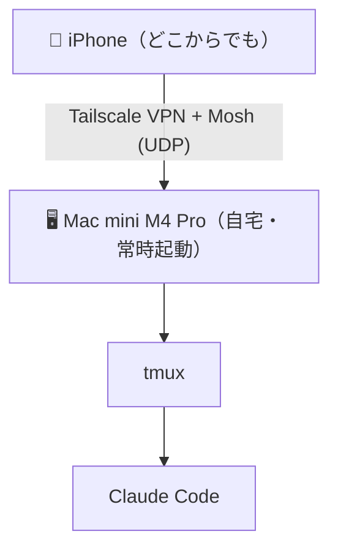

## SSHプロトコルを理解する

まず、MoshがなぜSSHの代替として必要なのかを理解するために、SSHの仕組みを掘り下げます。

### TCP — SSHの土台

SSHはトランスポート層にTCP（Transmission Control Protocol）を使います。TCPの接続確立は **3-way handshake** から始まります。

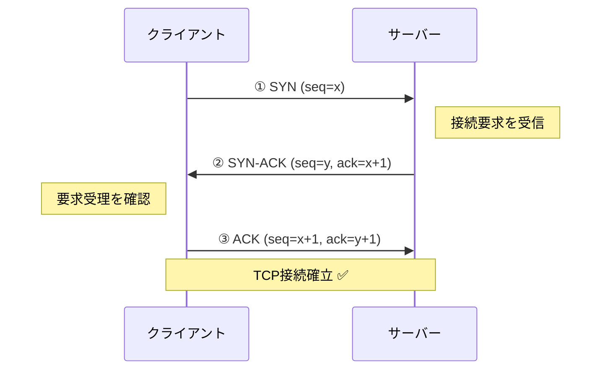

各ステップの役割を整理します：

| ステップ | パケット | 役割 |
|----------|----------|------|
| ① **SYN** | クライアント → サーバー | 「接続したい」という要求。クライアントの初期シーケンス番号（ISN: x）を通知する。このシーケンス番号は以降のデータの順序管理に使われる |
| ② **SYN-ACK** | サーバー → クライアント | SYNに対する応答（ACK）と、サーバー自身の接続要求（SYN）を**1パケットにまとめて**返す。サーバーの初期シーケンス番号（ISN: y）を通知しつつ、`ack=x+1` でクライアントのSYNを受理したことを伝える |
| ③ **ACK** | クライアント → サーバー | サーバーのSYNに対する応答。`ack=y+1` でサーバーのシーケンス番号を確認。これで**双方向の通信路が確立**する |

SYN-ACKが2つの意味を兼ねている点が重要です。「あなたのSYNを受け取った（ACK）」と「私もあなたと接続したい（SYN）」を同時に伝えることで、4ステップではなく3ステップでハンドシェイクが完了します。

#### シーケンス番号（seq）とACK番号（ack）の使われ方

`ack=x+1` の「+1」は、「xまで受け取ったので、次は x+1 から送ってくれ」という意味です。ACK番号は常に**次に受け取りたいバイトの位置**を指します。

ハンドシェイク完了後、実際のデータ送受信ではこのシーケンス番号がバイト単位のカウンタとして機能します：

```
クライアント → サーバー: 500バイト送信 (seq=x+1)
サーバー → クライアント: ACK (ack=x+501)  ← "x+501番目から送って"

サーバー → クライアント: 200バイト送信 (seq=y+1)
クライアント → サーバー: ACK (ack=y+201)  ← "y+201番目から送って"
```

このシーケンス番号の仕組みにより、TCPは以下を実現しています：

- **順序保証**: パケットが順番通りに届かなくても、シーケンス番号で正しい順序に並べ直せる
- **欠損検知**: ACKが返ってこないシーケンス番号があれば、そのデータが届いていないとわかる → 再送する
- **重複排除**: 同じシーケンス番号のデータが2回届いても、2回目を捨てられる

裏を返せば、このシーケンス番号による厳密な順序管理が、TCPの「切れやすさ」の原因でもあります。パケットが1つ欠損するだけで、後続の全パケットがバッファで待たされる（**Head-of-Line Blocking**）ため、不安定なネットワークでは遅延が雪だるま式に増大します。

この3ステップを経て初めてデータ送受信が可能になります。TCPは以降も全データに対してACK（確認応答）を要求し、届かなければ再送します。信頼性は高いですが、このステートフルな仕組みが「接続」という概念を生み出しており、IPアドレスが変わると接続そのものが無効になります。

TCPの接続は **4タプル（送信元IP、送信元ポート、宛先IP、宛先ポート）** で識別されます。このうちどれか一つでも変わると、それは「別の接続」として扱われます。Wi-Fiからモバイル回線に切り替わるとクライアントのIPアドレスが変わるため、既存のTCP接続は維持できません。

### SSHハンドシェイク — 接続確立の全体像

TCP接続が確立した上で、SSHプロトコル自体のハンドシェイクが始まります。

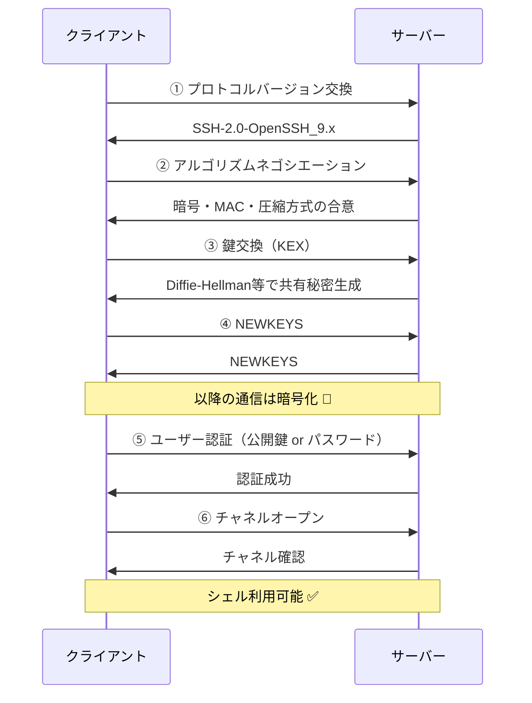

各フェーズを詳しく見ていきます。

### 鍵交換（Key Exchange）

SSHの鍵交換はDiffie-Hellman系のアルゴリズムで行われます。現在主流なのは `curve25519-sha256` です。

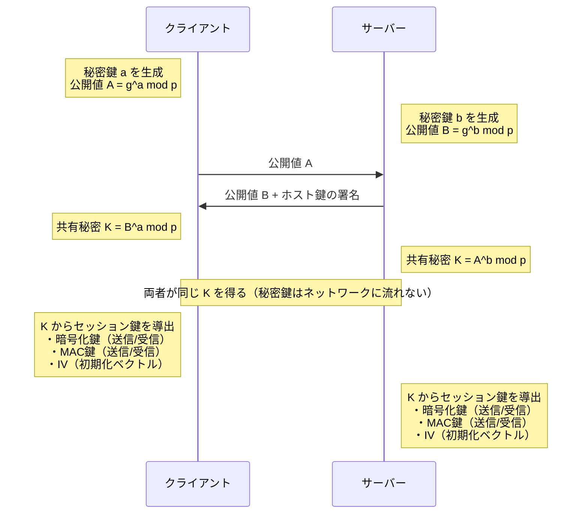

秘密鍵 a, b はそれぞれの側でランダムに生成されます。現在主流の `curve25519-sha256` では、OSの暗号論的乱数生成器（`/dev/urandom` 等）から32バイト（256ビット）のランダム値を取得し、それを秘密鍵として使います。接続のたびに新しいランダム値が生成されるため、仮にある接続の秘密鍵が漏洩しても過去や未来の接続には影響しません（**前方秘匿性 / Forward Secrecy**）。

ポイントは、この秘密鍵（a, b）は一切ネットワーク上を流れないこと。たとえ通信を傍受されても、共有秘密Kを逆算することは計算量的に不可能（離散対数問題）です。

#### なぜ両者のKは同じ値になるのか

数学的にはたった2行で証明できます。

```
クライアントが計算する K = B^a = (g^b)^a = g^(ba)  mod p
サーバーが計算する   K = A^b = (g^a)^b = g^(ab)  mod p
```

$g^{ba} = g^{ab}$ なので、両者は必ず同じ値になります。

#### ホスト鍵の署名 — なぜ必要なのか

鍵交換の図で、サーバーは公開値 B と一緒に**ホスト鍵の署名**を送っています。これはDiffie-Hellman単体の弱点を補うためです。

DH鍵交換だけでは、クライアントは「公開値 B を送ってきた相手が本物のサーバーかどうか」を確認できません。攻撃者が通信を中継して、クライアントとサーバーそれぞれに別の公開値を渡せば、双方と別々の共有秘密を確立できてしまいます（**中間者攻撃 / MITM**）。

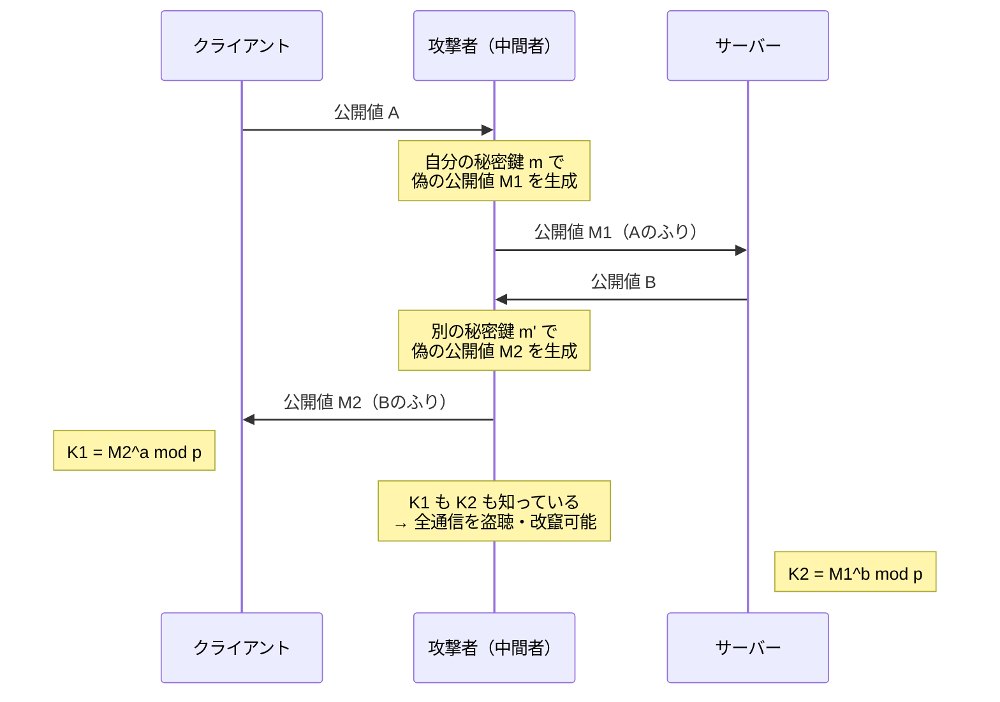

これを防ぐために、サーバーはDH公開値 B を送る際に、サーバーの**ホスト鍵**（`/etc/ssh/ssh_host_ed25519_key` 等）で署名を付けます。クライアントは `~/.ssh/known_hosts` に保存されたサーバーの公開鍵で署名を検証し、相手が本物のサーバーであることを確認します。

初めてサーバーに接続したときに表示されるこのメッセージは、まさにホスト鍵を信頼するかどうかの確認です：

```
The authenticity of host 'example.com' can't be established.
ED25519 key fingerprint is SHA256:xxxxx.
Are you sure you want to continue connecting (yes/no)?
```

ここで `yes` と答えると、そのホスト鍵が `known_hosts` に保存され、以降の接続では自動的に検証されます。もしサーバーのホスト鍵が変わっていた場合（＝中間者攻撃の可能性）、SSHは `WARNING: REMOTE HOST IDENTIFICATION HAS CHANGED!` と警告を出して接続を拒否します。

### SSH暗号化の仕組み

鍵交換が完了すると、以降の全通信は暗号化されます。

#### 旧方式（暗号化 + MAC 分離）

従来の `aes256-ctr` + `hmac-sha2-256` のような方式では、暗号化と改竄検知が別々のアルゴリズムで行われます。

| SSHパケット（旧方式） | サイズ | 備考 |
|----------------------|--------|------|
| パケット長 | 4 bytes | |
| パディング長 | 1 byte | |
| ペイロード | 可変長 | 実際のデータ |
| パディング | 4〜255 bytes | |
| **MAC（メッセージ認証コード）** | 可変長 | パケットが改竄されていないことを検証 |

処理の流れは「①平文を暗号化 → ②平文からMACを計算 → ③暗号文とMACを送信」の2パスです。受信側は「①MACで改竄チェック → ②復号」の順で処理します。

この方式には問題があります。暗号化とMACが独立しているため、実装の組み合わせ方によっては**パディングオラクル攻撃**のような脆弱性が生まれます。実際にSSHではこの種の攻撃が報告されました。

#### 現在の主流 — AEAD方式

現在のOpenSSHで優先されるのは `chacha20-poly1305` や `aes256-gcm` などのAEAD（Authenticated Encryption with Associated Data）方式です。

| SSHパケット（AEAD方式） | サイズ | 備考 |
|------------------------|--------|------|
| パケット長 | 4 bytes | 別鍵で暗号化（`chacha20-poly1305` の場合） |
| パディング長 | 1 byte | |
| ペイロード | 可変長 | 実際のデータ |
| パディング | 4〜255 bytes | |
| **認証タグ** | 16 bytes | 暗号化と同時に生成。MACの代わり |

AEADでは暗号化と認証が1つのアルゴリズムに統合されており、1パスで処理が完了します。暗号化と改竄検知が不可分なため、旧方式のように実装の組み合わせで脆弱性が生まれる余地がありません。

### SSH公開鍵認証

パスワード認証より安全な公開鍵認証の流れ：

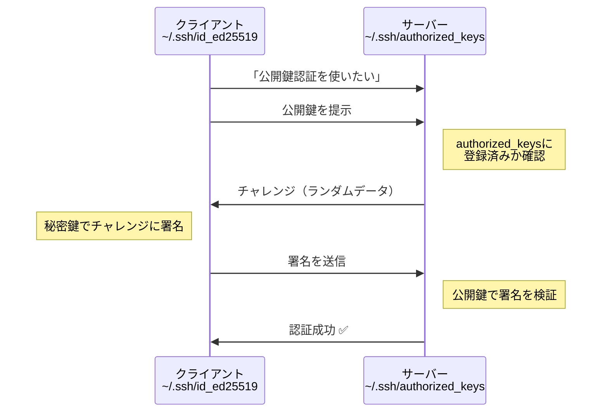

秘密鍵がネットワーク上を流れることは一切ありません。サーバーは公開鍵で署名を検証するだけです。

### SSHがモバイル環境で破綻する理由

ここまでの仕組みを踏まえると、SSHがモバイル環境で弱い理由が明確になります。

1. **TCP 4タプルの制約**: IPが変わると接続が別物になり、上記のハンドシェイクを最初からやり直す必要がある
2. **ステートフルな暗号化**: シーケンス番号ベースでMAC/暗号化を行うため、パケットが1つでも失われるとストリーム全体が壊れる
3. **TCPの再送タイムアウト**: パケットロスが続くとTCPの再送間隔が指数的に増大（最大60秒以上のタイムアウト）
4. **キープアライブの限界**: `ServerAliveInterval` を設定しても、ネットワーク切替時には間に合わない

---

## Moshプロトコルを理解する

MoshはSSHの上記の制約を根本的に回避する設計になっています。

### 初回ブートストラップ — SSHからUDPへの移行

Moshの接続開始時、実はSSHを使います。ただしSSHを使うのはこの一瞬だけです。

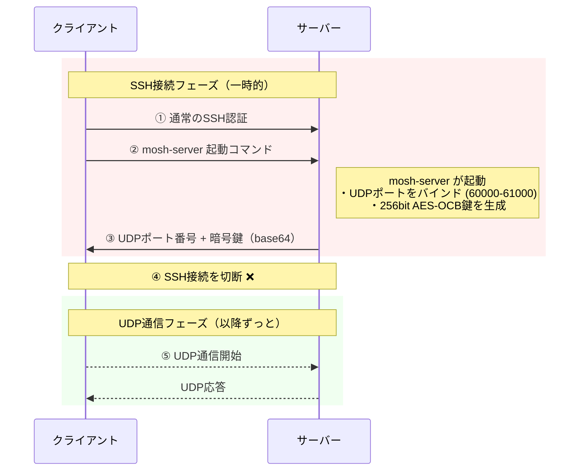

SSHは鍵をセキュアに渡すためのブートストラップとしてのみ使われ、実際のターミナル通信はUDPに完全移行します。

### UDP — なぜ「接続」が切れないのか

UDPのパケット（データグラム）構造を見てみます。

| UDPパケット | サイズ |
|-------------|--------|
| 送信元ポート | 2 bytes |
| 宛先ポート | 2 bytes |
| データ長 | 2 bytes |
| チェックサム | 2 bytes |
| ペイロード（Moshのデータ） | 可変長 |

ヘッダはわずか8バイト（TCPは最低20バイト）。シーケンス番号もACKもありません。

TCPと比較したときの決定的な違い：

- **接続状態を持たない（コネクションレス）**: 各パケットが独立しており、「接続」という概念がない
- **順序保証なし**: パケットが順番通り届く保証がない（Mosh側で対処する）
- **到達保証なし**: パケットが届かなくてもプロトコル層では何もしない
- **ハンドシェイク不要**: いきなりデータを送れる

「接続」がないということは、**送信元IPが変わっても「接続が切れる」ことが原理的に起こらない**。サーバー側は「正しい暗号鍵で復号できるパケットが届いた」ことだけを確認すればよく、それがどのIPアドレスから来たかは気にしません。

### Moshの暗号化 — AES-128-OCB

MoshはAES-128-OCB（Offset Codebook Mode）で暗号化を行います。

| Mosh UDPデータグラム | サイズ | 説明 |
|---------------------|--------|------|
| nonce | 8 bytes | パケットごとにユニークな番号。シーケンス番号 + 方向ビットで構成 |
| 暗号文 + 認証タグ | 可変長 | OCBで一体生成。ターミナル状態の差分データを暗号化し、改竄検知も1パスで実行 |

OCBモードの選択は意図的です：

| 特性 | OCBモード | GCMモード（SSH等で使用） |
|------|-----------|----------------------|
| 暗号化+認証のパス数 | 1パス | 2パス |
| レイテンシ | 低い | やや高い |
| 特許 | 2021年に無料化 | もともと無料 |
| パケット単位での処理 | 適している | 適している |

UDPは各パケットが独立しているため、パケット単位で暗号化・復号できるOCBモードが合理的です。パケットが途中で失われても、後続パケットの復号には影響しません（SSHのストリーム暗号方式との決定的な違い）。

nonceにはシーケンス番号が使われるため、**リプレイ攻撃（古いパケットを再送する攻撃）も検知できます**。

### SSP（State Synchronization Protocol）

Moshの中核がSSP — 画面の「状態」を同期するプロトコルです。SSHが「入力バイト列をそのまま転送」するのに対して、Moshは「画面がどう見えるべきか」を同期します。

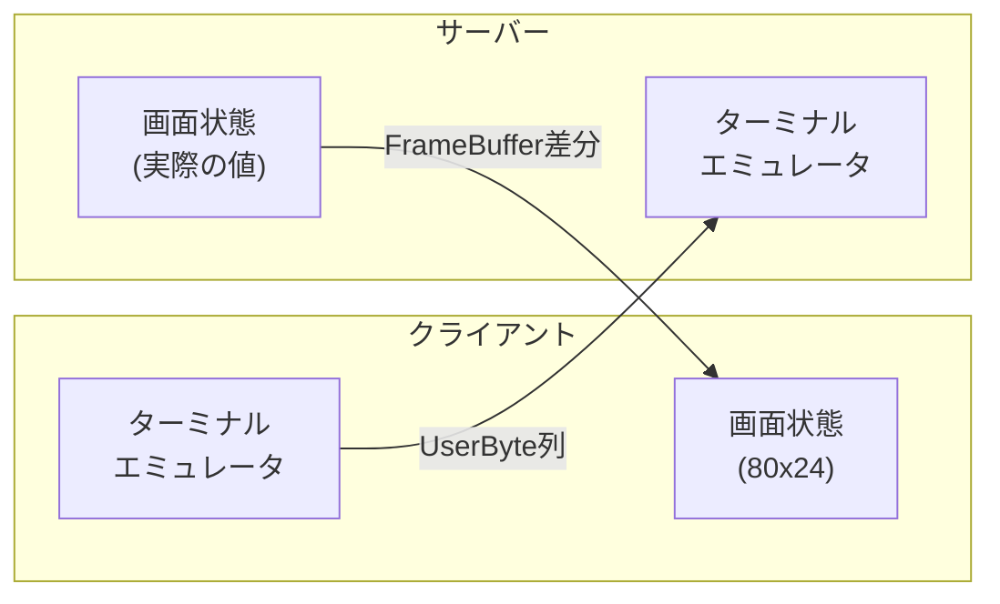

SSPの同期ルール：

- 各フレームに通し番号（epoch）を付与
- サーバー → クライアントに「最新の画面状態」を送信
- クライアントは最後に受信した番号をACKとして返す
- サーバーはACKされていない最新状態を再送
- 順序逆転やパケットロスがあっても、常に「最新の状態」だけを適用

従来のSSHとの違いを具体例で説明すると：

**SSHの場合**: `ls -la` の出力が100行ある場合、100行分のバイト列を順番通り送る必要がある。途中の1パケットが失われるとTCPの再送を待つことになり、画面表示が止まる。

**Moshの場合**: `ls -la` の出力後の「画面の最終状態」（80×24の文字グリッド）を送る。途中のパケットが失われても、次のパケットで最新の画面状態が届けば問題ない。古い中間状態はスキップされる。

### ローミング — IPアドレス変更への対応

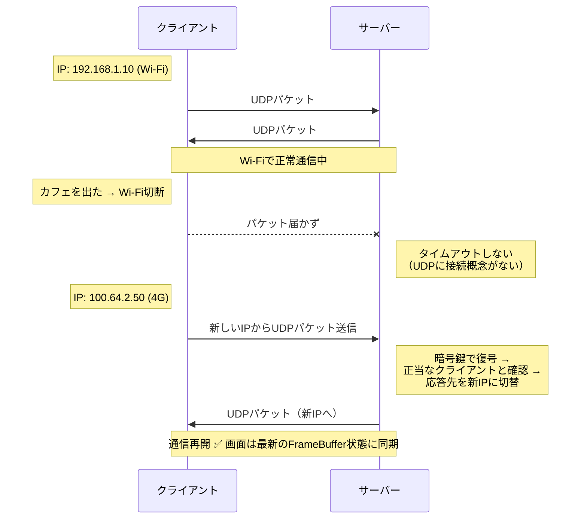

認証は暗号鍵ベースなので、IPアドレスが何回変わろうと、正しい鍵でパケットを暗号化できている限り通信は継続します。再認証は不要です。

### ローカルエコーと予測表示

Moshのもう一つの特徴が、入力の予測表示です。

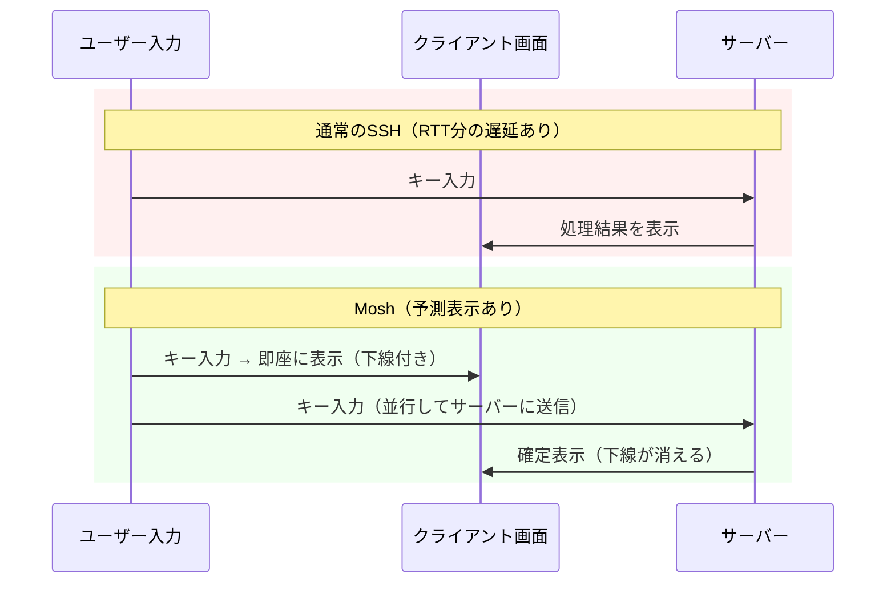

クライアント側にもターミナルエミュレータが組み込まれており、入力文字を即座に表示します。予測中の文字は下線付きで表示され、サーバーから実際の結果が返ってくると確定表示に切り替わります。RTT（Round-Trip Time）が100ms以上の環境では、この予測表示の有無が体感速度に大きく影響します。

### ポートとNATの考慮

Moshはサーバー側で **UDP 60000〜61000** のポート範囲を使用します。

```
ファイアウォール設定（mosh-serverを直接公開する場合）:
  UDP 60000:61000 を開放

Tailscale経由の場合:
  → ポート開放不要（Tailscaleがトンネリングを行う）
  → NAT越えもTailscaleが自動処理
```

NAT（Network Address Translation）環境では、UDPの穴あけ（UDP hole punching）が必要になる場合がありますが、Tailscaleを使う構成ならこの問題は完全に回避できます。Tailscaleの内部で使われているWireGuardプロトコル自体がUDPベースでNAT越えに対応しているため、Moshとの相性が非常に良い構成です。

### SSH vs Mosh — プロトコル比較まとめ

| 観点 | SSH | Mosh |
|------|-----|------|
| トランスポート | TCP | UDP |
| 接続モデル | ステートフル（4タプルで識別） | ステートレス（暗号鍵で認証） |
| 暗号化 | AES-GCM / ChaCha20-Poly1305 | AES-128-OCB |
| 暗号化単位 | ストリーム（連続バイト列） | パケット単位（独立） |
| パケットロス時 | 再送待ちでブロック | 最新状態で上書き |
| IP変更時 | 接続断 → 再ハンドシェイク | 自動ローミング |
| 画面同期方式 | バイトストリーム転送 | FrameBuffer状態同期（SSP） |
| 入力遅延 | RTT依存 | ローカルエコーで即時表示 |
| 使用ポート | TCP 22 | UDP 60000-61000 |
| 初回認証 | SSH自身で完結 | SSHでブートストラップ |

## iOSターミナルアプリの比較

Mosh対応のiOSアプリはいくつかあります。

| アプリ | 価格 | Mosh対応 | 特徴 |
|--------|------|----------|------|
| **Moshi** | 無料（ベータ） | ○ | Webhook通知、Whisper音声入力、tmuxボタン |
| **Blink Shell** | 月額$12.99 | ○ | 老舗・高機能だがサブスク移行で高額に |
| **Echo** | 買い切り$2.99 | ○ | Ghosttyベース描画、iPad対応 |
| **Termius** | 基本無料 | × | クロスプラットフォーム、UIが綺麗 |

Moshiを選んだ理由はシンプルで、**Claude Codeとの連携機能（Webhook通知）が組み込まれている**こと。ベータ版で無料なのも試しやすい。

## セットアップ手順

### 前提

- 自宅にMac（常時起動できるもの。Mac miniが理想）
- iPhone
- Tailscaleアカウント（無料プラン、最大100デバイス）

### 構成図

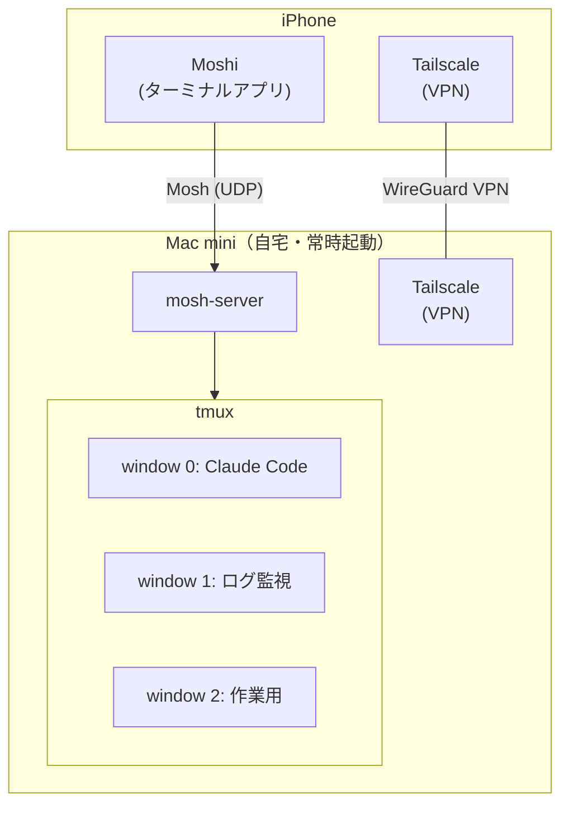

### Step 1: Mac側 — moshとtmuxをインストール

```bash
brew install mosh tmux
```

Homebrewが入ってなければ先に入れてください。

### Step 2: Mac側 — Tailscaleをセットアップ

1. [tailscale.com](https://tailscale.com/) からMac用アプリをインストール
2. Google/GitHub等のアカウントでログイン
3. Tailscale SSHを有効化

Tailscale SSHを有効にすると、SSH鍵の手動管理なしでTailscale経由のSSH接続が可能になります。ポート開放もファイアウォール設定も不要。

### Step 3: iPhone側 — MoshiとTailscaleをインストール

1. App Storeから**Moshi**と**Tailscale**をダウンロード
2. TailscaleにMac側と同じアカウントでログイン
3. これでiPhoneとMacが同一Tailscaleネットワークに参加した状態になる

### Step 4: Moshiに接続先を登録

1. Moshiアプリを開く
2. 新しい接続先を追加
3. ホスト名にMac miniのTailscale IP（`100.x.x.x` 形式）を入力
4. 接続方式を「Mosh」に設定

### Step 5: tmuxセッションを起動して接続

Mac側でtmuxセッションを作成：

```bash
tmux new -s dev
```

iPhone側のMoshiから接続し、既存セッションにアタッチ：

```bash
tmux attach -t dev
```

これでiPhoneからMac上のtmuxセッションを操作できます。Claude Codeをtmux内で起動しておけば、iPhoneを閉じても作業は継続されます。

## Webhook通知 — 放置して通知を待つワークフロー

Moshiの目玉機能がWebhook通知です。Claude Codeのタスク完了をiPhoneにプッシュ通知できます。

### 設定方法

プロジェクトの`CLAUDE.md`に以下を追記するだけ：

```bash
curl -X POST https://getmoshi.app/api/webhook/あなたのトークン
```

トークンはMoshiアプリ内から取得できます。

### ワークフロー

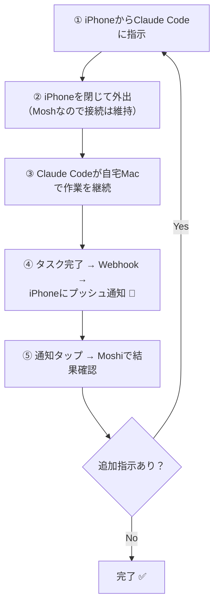

PCの前に張り付く必要がない。移動中でも、Claude Codeに仕事を任せて通知を待つだけ。AIエージェント時代の開発スタイルとして理にかなっています。

## Whisper音声入力

MoshiにはOpenAIのWhisperモデルが組み込まれており、**iPhoneのローカルで音声認識が動く**。

- 音声データがクラウドに送られない（プライバシー面で安心）
- 事前にモデルをダウンロードしておけばオフラインでも動作
- Apple純正の音声入力と比べてプログラミング用語の認識精度が高い
- キーボードボタン長押しで起動

iPhoneのソフトキーボードでコマンドを打つのはしんどいので、音声でプロンプトを入力 → Claude Codeに投げる、という使い方が快適です。

ただし、PC向けのAI音声入力サービス（AquaVoice、Typelessなど）と比較すると、文章の整形力では差があります。ターミナルアプリに内蔵された機能としては十分という位置づけです。

## tmux連携ボタン

PCでtmuxを操作する場合、プレフィックスキー（`Ctrl+B`）を押してからコマンドキーを入力する2ステップの操作が必要です。

iPhoneのソフトキーボードで`Ctrl+B`を入力するのは面倒ですが、Moshiにはtmuxのショートカットがワンタップボタンとして用意されています。ウィンドウ切り替え、ペイン操作などがボタン一つで実行可能です。

## 実際の使用感

### 向いている使い方

- Claude Codeにプロンプトを投げる
- ビルド・テスト結果の確認
- AIエージェントの進捗チェック
- サブエージェントの結果確認

### 向かない使い方

- iPhoneでコードを直接書く（画面が小さすぎる）
- 複数のターミナルを同時に見比べる

要するに、iPhoneは**「AIへの指示出し＋結果確認のリモコン」**として使うのが正解。コードを書く作業自体はClaude Codeに任せて、人間は指示とレビューに集中するスタイルです。

## 現時点の制限事項

- **iPad未対応**: 2026年2月時点ではiPhoneのみ。開発者がiPad対応予定を表明しているので近日中に対応される見込み
- **tmuxボタンのカスタマイズ不可**: 用意されたボタンは固定で、ユーザー定義のショートカットは設定できない
- **価格の不透明さ**: ベータ版は無料だが、正式版での価格は未定。Blink Shellが月額$12.99のサブスクに移行した前例もあるので、無料のうちに試しておくのが吉

## まとめ

Moshi + Mosh + Tailscale + tmux の構成は、**iPhoneをClaude Codeのリモコンにする**ための現時点のベストプラクティスだと思います。

ポイントをまとめると：

- Moshプロトコルで「切れない接続」を実現
- TailscaleでVPN構築の面倒を排除（ポート開放不要、無料）
- tmuxでセッション永続化 → iPhoneを閉じてもClaude Codeは稼働
- Webhook通知で「放置→通知→確認→追加指示」の非同期ワークフロー
- Whisper音声入力でソフトキーボードのストレスを軽減

Claude CodeやCodexのようなAIエージェントが普及するにつれて、「PCの前に座って作業する」スタイルから「指示を出して結果を待つ」スタイルへの移行が進んでいくはずです。そのときに、iPhoneからシームレスに操作できる環境を持っておくと、開発の自由度が大きく変わります。
