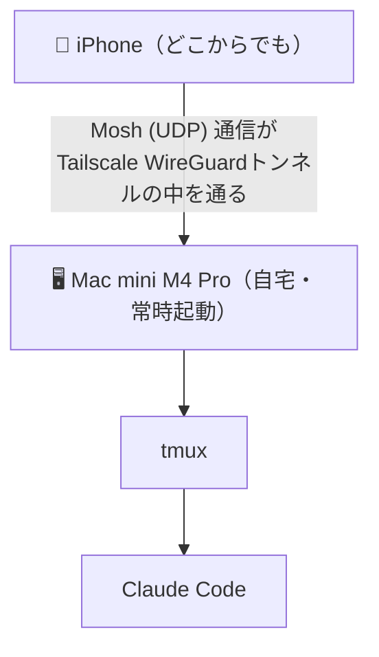
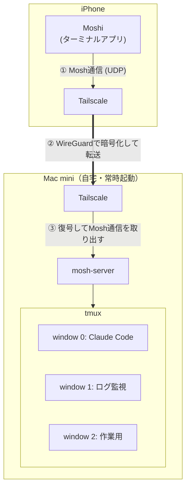
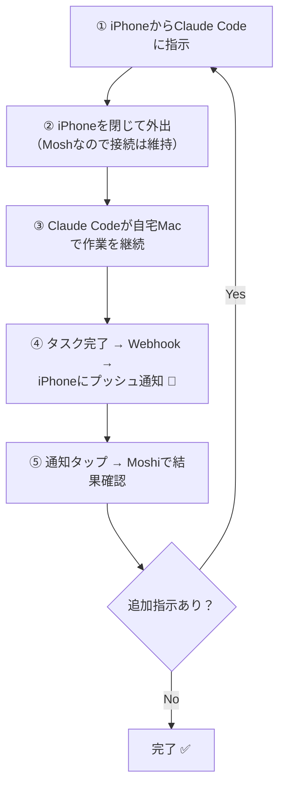

# iPhoneからClaude Codeを操作する最強構成 — Moshi + Mosh + Tailscale + tmux

iPhoneがClaude Codeのリモコンになる。そんな環境を組んでみたら思った以上に快適だったので、構成と手順をまとめます。

## TL;DR

- **Moshi**（iOSターミナルアプリ）で自宅Mac miniにMosh接続
- Wi-Fi↔モバイル回線の切り替えでも接続が途切れない
- tmuxでセッション維持 → iPhoneを閉じてもClaude Codeは動き続ける
- Webhook通知でタスク完了をプッシュ通知 → 通知が来たら結果を確認するだけ



## なぜMoshなのか — SSHの課題とMoshの解決策

この構成のカギはMosh（Mobile Shell）です。SSHの代わりにMoshを使うことで、モバイル環境特有の問題を解決しています。

**SSHの課題**: SSHはTCPベースのプロトコルで、IPアドレスが変わると接続が切れます。Wi-Fiからモバイル回線に切り替わるたびに再接続が必要になり、iPhoneからの操作には致命的です。

**Moshの解決策**: MoshはUDPベースで「接続」の概念を持ちません。暗号鍵でクライアントを認証するため、IPアドレスが変わっても通信が継続します。さらに、画面の「状態」を同期する設計（SSP）により、パケットロスがあっても最新の画面状態が即座に反映されます。

| 観点 | SSH | Mosh |
|------|-----|------|
| トランスポート | TCP | UDP |
| IP変更時 | 接続断 → 再接続 | 自動ローミング |
| パケットロス時 | 再送待ちでブロック | 最新状態で上書き |
| 入力遅延 | RTT依存 | ローカルエコーで即時表示 |

プロトコルの仕組みを詳しく知りたい方は、以下の記事で解説しています：

- [SSHプロトコルを理解する — 仕組みから学ぶセキュア通信の基礎](ssh-protocol-article.md)
- [Moshプロトコルを理解する — モバイル時代のリモートターミナル](mosh-protocol-article.md)

## iOSターミナルアプリの比較

Mosh対応のiOSアプリはいくつかあります。

| アプリ | 価格 | Mosh対応 | iPad対応 | 特徴 |
|--------|------|----------|----------|------|
| **Moshi** | 無料（ベータ） | ○ | × | Webhook通知、Whisper音声入力、tmuxボタン |
| **Blink Shell** | 年額$19.99 | ○ | ○ | オープンソース、老舗・高機能。買い切りからサブスク移行 |
| **Echo** | 買い切り$2.99 | ○ | ○ | Ghosttyベース・Metal GPU描画で高速 |
| **Termius** | 基本無料（プレミアム月額$9.99） | ○ | ○ | クロスプラットフォーム、チーム管理機能 |

すべてのアプリがMoshに対応していますが、Moshiを選んだ理由は**Claude Codeとの連携機能（Webhook通知・音声入力）が組み込まれている**こと。AIエージェントとの協業に特化した唯一のアプリです。ベータ版で無料なのも試しやすい。

## セットアップ手順

### 前提

- 自宅にMac（常時起動できるもの。Mac miniが理想）
- iPhone
- Tailscaleアカウント（無料プラン、最大100デバイス）

### 構成図



### Step 1: Mac側 — スリープを無効化する

Macが自動でスリープすると接続が切れるので、常時起動の設定をします。

**システム設定 → エネルギー** で以下を有効化：

- 「ディスプレイがオフのときに自動でスリープさせない」
- 「ネットワークアクセスによるスリープ解除」
- 「停電後に自動的に起動」

### Step 2: Mac側 — リモートログインを有効化する

Moshの初回接続時にSSHが必要なため、リモートログインを許可します。

**システム設定 → 一般 → 共有 → リモートログイン** を有効化

### Step 3: Mac側 — mosh、tmux、Tailscaleをインストール

Homebrewが未導入の場合はまずインストール：

```bash
/bin/bash -c "$(curl -fsSL https://raw.githubusercontent.com/Homebrew/install/HEAD/install.sh)"
```

必要なツールをまとめてインストール：

```bash
brew install mosh tmux tailscale
```

### Step 4: Mac側 — tmuxを設定する

`~/.tmux.conf` を作成して以下を記述：

```
# スクロールバッファを50,000行に拡張（デフォルトは2,000行）
set -g history-limit 50000

# マウスでのスクロール・ペイン選択を有効化
set -g mouse on

# ウィンドウのタイトルを自動反映
set -g set-titles on
set -g set-titles-string "#I: #T"

# ウィンドウ番号を1から開始（0だとキーボードで押しにくい）
set -g base-index 1
setw -g pane-base-index 1
```

**注意: moshにはスクロールバック機能がありません。** tmuxなしでmosh接続すると、画面外に流れた出力を遡れません。tmuxとの併用は必須です。

### Step 5: Mac側 — Tailscaleをセットアップ

Tailscaleを起動し、SSHアクセスを有効化します：

```bash
sudo tailscale up --ssh
```

Google/GitHub等のアカウントでログインし、Mac miniのTailscale IPを確認：

```bash
tailscale ip
```

`100.x.x.x` 形式のIPアドレスが表示されます。この値を後でMoshiアプリに入力します。

Tailscale SSHを有効にすると、SSH鍵の手動管理なしでTailscale経由のSSH接続が可能になります。ポート開放もファイアウォール設定も不要。

### Step 6: Mac側 — SSHのセキュリティを強化する（推奨）

パスワード認証を無効化して、鍵認証のみに制限します：

`/etc/ssh/sshd_config` を編集：

```
PasswordAuthentication no
ChallengeResponseAuthentication no
```

SSHを再起動して反映：

```bash
sudo launchctl stop com.openssh.sshd
sudo launchctl start com.openssh.sshd
```

**重要: SSHポートをインターネットに直接公開してはいけません。** 必ずTailscale等のVPN経由でアクセスしてください。

### Step 7: iPhone側 — MoshiとTailscaleをインストール

1. App Storeから**Moshi**と**Tailscale**をダウンロード
2. TailscaleにMac側と同じアカウントでログイン
3. これでiPhoneとMacが同一Tailscaleネットワークに参加した状態になる

### Step 8: Moshiに接続先を登録

1. Moshiアプリを開く
2. 新しい接続先を追加
3. ホスト名にStep 5で確認したTailscale IP（`100.x.x.x`）を入力
4. 接続方式を「Mosh」に設定

### Step 9: tmuxセッションを起動して接続

Mac側でtmuxセッションを作成：

```bash
tmux new -s dev
```

iPhone側のMoshiから接続し、既存セッションにアタッチ：

```bash
tmux attach -t dev
```

これでiPhoneからMac上のtmuxセッションを操作できます。Claude Codeをtmux内で起動しておけば、iPhoneを閉じても作業は継続されます。

よく使うtmuxコマンド：

| コマンド | 操作 |
|----------|------|
| `Ctrl+B, c` | 新しいウィンドウを作成 |
| `Ctrl+B, n` / `Ctrl+B, p` | 次/前のウィンドウに切り替え |
| `Ctrl+B, d` | セッションからデタッチ（セッションは維持） |
| `Ctrl+B, &` | 現在のウィンドウを閉じる |

## Webhook通知 — 放置して通知を待つワークフロー

Moshiの目玉機能がWebhook通知です。Claude Codeのタスク完了をiPhoneにプッシュ通知できます。

### 設定方法

1. Moshiアプリの **Settings → Notifications** からWebhookトークンをコピー
2. プロジェクトの`CLAUDE.md`に以下を追記：

```bash
curl -s -X POST https://api.getmoshi.app/api/webhook \
  -H "Content-Type: application/json" \
  -d '{"token": "あなたのトークン", "title": "Status", "message": "Brief summary"}'
```

Claude Codeがタスクを完了するたびにこのコマンドが実行され、iPhoneにプッシュ通知が届きます。

### ワークフロー



PCの前に張り付く必要がない。移動中でも、Claude Codeに仕事を任せて通知を待つだけ。AIエージェント時代の開発スタイルとして理にかなっています。

## Whisper音声入力

MoshiにはOpenAIのWhisperモデルが組み込まれており、**iPhoneのローカルで音声認識が動く**。

- 音声データがクラウドに送られない（プライバシー面で安心）
- 事前にモデルをダウンロードしておけばオフラインでも動作
- Apple純正の音声入力と比べてプログラミング用語の認識精度が高い
- キーボードボタン長押しで起動

iPhoneのソフトキーボードでコマンドを打つのはしんどいので、音声でプロンプトを入力 → Claude Codeに投げる、という使い方が快適です。

ただし、PC向けのAI音声入力サービス（AquaVoice、Typelessなど）と比較すると、文章の整形力では差があります。ターミナルアプリに内蔵された機能としては十分という位置づけです。

## tmux連携ボタン

PCでtmuxを操作する場合、プレフィックスキー（`Ctrl+B`）を押してからコマンドキーを入力する2ステップの操作が必要です。

iPhoneのソフトキーボードで`Ctrl+B`を入力するのは面倒ですが、Moshiにはtmuxのショートカットがワンタップボタンとして用意されています。ウィンドウ切り替え、ペイン操作などがボタン一つで実行可能です。

## 実際の使用感

### 向いている使い方

- Claude Codeにプロンプトを投げる
- ビルド・テスト結果の確認
- AIエージェントの進捗チェック
- サブエージェントの結果確認

### 向かない使い方

- iPhoneでコードを直接書く（画面が小さすぎる）
- 複数のターミナルを同時に見比べる

要するに、iPhoneは**「AIへの指示出し＋結果確認のリモコン」**として使うのが正解。コードを書く作業自体はClaude Codeに任せて、人間は指示とレビューに集中するスタイルです。

## 現時点の制限事項

- **iPad未対応**: 2026年2月時点ではiPhoneのみ。開発者がiPad対応予定を表明しているので近日中に対応される見込み
- **tmuxボタンのカスタマイズ不可**: 用意されたボタンは固定で、ユーザー定義のショートカットは設定できない
- **価格の不透明さ**: ベータ版は無料だが、正式版での価格は未定。Blink Shellが月額$12.99のサブスクに移行した前例もあるので、無料のうちに試しておくのが吉

## まとめ

Moshi + Mosh + Tailscale + tmux の構成は、**iPhoneをClaude Codeのリモコンにする**ための現時点のベストプラクティスだと思います。

ポイントをまとめると：

- Moshプロトコルで「切れない接続」を実現
- TailscaleでVPN構築の面倒を排除（ポート開放不要、無料）
- tmuxでセッション永続化 → iPhoneを閉じてもClaude Codeは稼働
- Webhook通知で「放置→通知→確認→追加指示」の非同期ワークフロー
- Whisper音声入力でソフトキーボードのストレスを軽減

Claude CodeやCodexのようなAIエージェントが普及するにつれて、「PCの前に座って作業する」スタイルから「指示を出して結果を待つ」スタイルへの移行が進んでいくはずです。そのときに、iPhoneからシームレスに操作できる環境を持っておくと、開発の自由度が大きく変わります。
