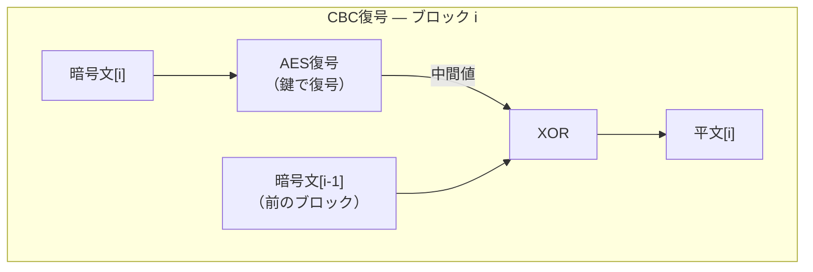

# パディングオラクル攻撃を理解する — 暗号鍵なしで暗号文を解読する手法

「暗号化されているから安全」と思い込んでいないでしょうか。パディングオラクル攻撃は、暗号アルゴリズムそのものを破るのではなく、**復号処理のエラー応答**という小さな情報漏洩を繰り返し利用して暗号文を解読する攻撃手法です。

SSHの旧方式（CBCモード + MAC分離）やTLS（SSL）の過去のバージョンで実際に報告されており、AEADのような統合型暗号方式が主流になった背景でもあります。

この記事では、攻撃の前提知識（ブロック暗号のモード、XOR演算、パディング規則）からステップバイステップで解説します。

## 前提知識 — ブロック暗号のモード

AESのようなブロック暗号は、データを16バイト（128ビット）のブロック単位で処理します。もっとも単純なECB（Electronic Codebook）モードでは、各ブロックを独立に暗号化します。

```
ECBモード暗号化:
  暗号文[0] = AES暗号化(平文[0])
  暗号文[1] = AES暗号化(平文[1])
  暗号文[2] = AES暗号化(平文[2])
```

しかしECBモードには致命的な弱点があります。**同じ平文ブロックは常に同じ暗号文ブロックになる**ため、データのパターンが暗号文にそのまま現れてしまいます。たとえば画像をECBモードで暗号化すると、同じ色の領域が同じ暗号文パターンになり、暗号化後でも画像の輪郭が見えてしまいます。

CBC（Cipher Block Chaining）モードは、この問題を**前のブロックの暗号文を次のブロックに連鎖させる**ことで解決します。連鎖に使われる演算がXORです。

## 前提知識 — XOR（排他的論理和）

XORは「2つのビットが異なれば1、同じなら0」を返すビット演算です。

```
XOR の真理値表:
  0 XOR 0 = 0
  0 XOR 1 = 1
  1 XOR 0 = 1
  1 XOR 1 = 0
```

実際のデータはバイト列なので、各ビット位置でこの演算を同時に行います。

```
例: 0x4D XOR 0x36

  0x4D = 0100 1101
  0x36 = 0011 0110
  XOR  = 0111 1011 = 0x7B
```

暗号で多用される理由は、XORが**自分自身の逆演算**になるからです。

```
A XOR B = C  のとき
C XOR B = A  ← 同じ値でもう一度XORすると元に戻る
```

この性質があるため、「暗号化のときにXORしたものを、復号のときに同じ値でXORすれば元に戻る」というシンプルな構造でCBCモードが成立します。

## CBCモードの暗号化と復号

**CBC暗号化**

```
CBC暗号化:
  暗号文[0] = AES暗号化(平文[0] XOR IV)          ← 最初のブロックは初期化ベクトル(IV)とXOR
  暗号文[1] = AES暗号化(平文[1] XOR 暗号文[0])    ← 前のブロックの暗号文とXOR
  暗号文[2] = AES暗号化(平文[2] XOR 暗号文[1])    ← 前のブロックの暗号文とXOR
```

平文をAES暗号化する**前に**、前ブロックの暗号文とXORすることで、同じ平文ブロックでも前のブロックが異なれば異なる暗号文になります。これでECBの弱点が解消されます。

**CBC復号**

復号はこの逆の操作です。暗号文ブロックをAES復号した後、**前の暗号文ブロック**をXORして平文を復元します。

```
CBC復号:
  平文[0] = AES復号(暗号文[0]) XOR IV
  平文[1] = AES復号(暗号文[1]) XOR 暗号文[0]      ← AES復号の結果に前の暗号文をXOR
  平文[2] = AES復号(暗号文[2]) XOR 暗号文[1]
```

一般化すると：

```
平文[i] = AES復号(暗号文[i]) XOR 暗号文[i-1]
```



この「前の暗号文ブロックとXORする」構造が攻撃の核です。なぜなら、`暗号文[i-1]` は暗号化されたデータではあるものの**攻撃者が自由に書き換えられる**からです。`暗号文[i-1]` の特定のバイトを変更すると、`平文[i]` の対応するバイトが**予測可能な形で変化**します（XORの性質上、変更したビットがそのまま平文に反映される）。

## 前提知識 — PKCS#7パディングの規則

ブロック暗号はデータをブロック単位（AESなら16バイト）で処理します。しかし、暗号化したいデータが常にちょうど16バイトの倍数とは限りません。たとえば「Hello」は5バイトしかないので、16バイトのブロックに11バイト足りません。この端数を埋めるのが「パディング」です。

```
ブロックサイズ: 16バイト
データ "Hello": 5バイト → 残り11バイトを何かで埋める必要がある

[H][e][l][l][o][?][?][?][?][?][?][?][?][?][?][?]
 ←── データ ──→ ←────── パディング ──────→
```

ここで問題になるのが、「受信側がパディングとデータの境界をどう見分けるか」です。PKCS#7パディングでは、シンプルな規則でこれを解決します：**埋めるバイトの値を、パディングの長さそのものにする**。

```
例: ブロックサイズ 16バイト、データ "Hello"（5バイト）→ パディング長 = 11

[H][e][l][l][o][0x0B][0x0B][0x0B][0x0B][0x0B][0x0B][0x0B][0x0B][0x0B][0x0B][0x0B]
 ←── データ ──→ ←──── 11バイトすべてが 0x0B（= 11）────→
```

受信側は復号後にブロックの最後の1バイトを読むだけで、パディングの長さがわかります。上の例なら最後のバイトが `0x0B`（= 11）なので、「末尾11バイトはパディング、残りの5バイトがデータ」と判断できます。

さらに短い例で規則を整理すると：

```
パディング1バイトの場合:  [...データ...] [0x01]           ← 最後の1バイトが 0x01
パディング2バイトの場合:  [...データ...] [0x02][0x02]      ← 最後の2バイトがすべて 0x02
パディング3バイトの場合:  [...データ...] [0x03][0x03][0x03] ← 最後の3バイトがすべて 0x03
```

**パディング検証**では、この規則に合っているかを確認します。たとえば復号後のブロックの末尾が以下のようになっていた場合：

```
有効:   [...] [0x03][0x03][0x03]  ← 最後の値が 0x03 で、末尾3バイトすべて 0x03 → OK ✅
無効:   [...] [0x03][0x02][0x03]  ← 最後の値が 0x03 だが、末尾3バイトが揃っていない → NG ❌
無効:   [...] [0x00]              ← 0x00 はパディング長0を意味するが、パディングなしは不正 → NG ❌
```

## パディングオラクル攻撃の仕組み

「オラクル」とは「Yes/Noで答えてくれる神託」のことです。攻撃者が細工した暗号文をサーバーに送ると、サーバーは意図せず「パディングが正しいか/正しくないか」をYes/Noで答えてしまいます。この「有効/無効」の判定結果がサーバーの応答の差異として漏れることが、パディングオラクル攻撃の出発点です。

応答の差異を繰り返し利用することで、**暗号鍵を知らなくても暗号文を1バイトずつ解読できます**。

### Step 1 — 最後の1バイトを解読する

攻撃者は暗号文を傍受しており、平文を知りたいとします。暗号鍵は知りません。

```
傍受した暗号文: [暗号文ブロック0][暗号文ブロック1]
知りたい平文:   [????????????????]  ← 暗号文ブロック1を復号した結果
```

攻撃者は `暗号文ブロック0` の最後の1バイトを総当たりで書き換えた偽パケットをサーバーに送ります。1バイトが取りうる値は `0x00` 〜 `0xFF` の256通りです（1バイト = 8ビット、$2^8$ = 256）。

```
中間値 = AES復号(暗号文ブロック1)  ← この値は固定（攻撃者は知らないが変わらない）
復号結果の最終バイト = 中間値の最終バイト XOR 書き換えた値
```

中間値の最終バイトは固定の未知数です。書き換えた値を0x00〜0xFFまで変えていくと、XORの結果も0x00〜0xFFのすべての値を1回ずつ取ります（XORの性質上、異なる入力は必ず異なる出力を生む）。

攻撃者が狙うのは、復号結果の最終バイトが `0x01` になるケースです。なぜ `0x01` なのか。PKCS#7パディングの検証は以下のように動作します：

1. 復号結果の最終バイトの値 N を読む
2. 復号結果の末尾 N バイトが**すべて** N であることを確認する

`0x01` は「パディング長1バイト」を意味し、**最終バイトだけが `0x01` であれば検証を通過**します。つまり、攻撃者が操作している最終1バイトだけで検証の合否が決まります。もし `0x02` を狙うと末尾2バイトが両方 `0x02` でなければならず、攻撃者が制御していない隣のバイトにも依存してしまいます。`0x01` を狙うのが最も効率的な戦略です。

256通りの中で `0x01` にヒットする値は正確に1つだけあり、そのときだけサーバーの応答が変わります：

```
書き換え値 = 0x00 → 復号結果末尾 = 0x37 → パディング検証 NG ❌
書き換え値 = 0x01 → 復号結果末尾 = 0x36 → パディング検証 NG ❌
...
書き換え値 = 0x36 → 復号結果末尾 = 0x01 → パディング検証 OK ✅ ← 応答が変わる
...
```

### `0x01` から平文を逆算する

エラーの違い（異なるエラーメッセージ、応答時間の差、接続の切れ方の違いなど）を観測できれば、「書き換え値 `0x36` のとき復号結果の末尾が `0x01` になった」とわかります。

ここで重要なのは、`0x01` は平文そのものではないということです。`0x01` はパディング検証を通過させるための**道具**であり、攻撃者が本当に知りたいのは「中間値」です。CBC復号の式を思い出すと：

```
復号結果 = 中間値 XOR 暗号文ブロック0
```

攻撃者が `暗号文ブロック0` の最終バイトを `0x36` に書き換えたとき、復号結果の最終バイトが `0x01` になった。これは：

```
中間値の最終バイト XOR 0x36 = 0x01
```

を意味します。XORの性質（`A XOR B = C` → `A = C XOR B`）から：

```
中間値の最終バイト = 0x01 XOR 0x36 = 0x37
```

これで中間値の最終バイト `0x37` が判明しました。中間値はAES復号の出力で、暗号鍵がなければ通常は知りようがない値です。それがパディングの応答差異から逆算できてしまいました。

あとは、元の（書き換えていない）暗号文ブロック0の最終バイトと中間値をXORすれば平文が求まります。元の暗号文ブロック0の最終バイトが `0xA5` だったとすると：

```
元の平文の最終バイト = 中間値の最終バイト XOR 元の暗号文ブロック0の最終バイト
                    = 0x37 XOR 0xA5 = 0x92
```

これで**暗号鍵を知らずに平文の最後の1バイト `0x92` が判明**しました。

### Step 2以降 — 全バイトを解読する

Step 1で中間値の最終バイト `0x37` が判明したので、Step 2では「末尾2バイトが `0x02 0x02` になる」ことを狙います。最終バイトは中間値がわかっているので、`0x02` になるよう逆算で固定できます：

```
最終バイトの書き換え値 = 中間値の最終バイト XOR 0x02 = 0x37 XOR 0x02 = 0x35
→ これで最終バイトは確実に 0x02 になる（総当たり不要）
```

あとは最後から2番目のバイトだけを 0x00〜0xFF で総当たりすれば、256回以内に「末尾2バイトが `0x02 0x02`」になる値が見つかります。これで中間値の最後から2番目のバイトも判明し、2バイト目の平文が解読できます。

```
Step 1: 末尾1バイトを総当たり → パディング 0x01 になる値を発見 → 1バイト目解読
Step 2: 末尾1バイトは逆算で固定 + 末尾2番目を総当たり → 0x02 0x02 → 2バイト目解読
Step 3: 末尾2バイトは逆算で固定 + 末尾3番目を総当たり → 0x03 0x03 0x03 → 3バイト目解読
... 16ステップでブロック全体を解読
```

各ステップで総当たりするのは**常に1バイトだけ**（最大256回）です。それ以外のバイトは前のステップで判明した中間値から逆算で固定できるため、計算量が爆発しません。

1バイトの解読に最大256回の試行、16バイトのブロックなら最大 256 × 16 = 4,096回の試行で復号できます。ブルートフォースで鍵を破る場合の天文学的な試行回数（AES-128なら $2^{128}$ 回）と比べると、**事実上一瞬で解読可能**です。

## SSHにおける実際の攻撃

SSHではCBCモードに加え、**パケット長フィールドの扱い**にも問題がありました。パケット長は暗号化されているものの、サーバーはこの値を復号して「何バイト読めばよいか」を判断します。攻撃者がこの部分を操作すると、サーバーが異常な長さのデータを読み取ろうとし、その振る舞いの差異から情報が漏洩します。2008年に報告されたCVE-2008-5161では、この手法により暗号文から $2^{18}$（約26万）回の試行で14ビットの平文を回復できることが実証されました。

## AEAD方式による解決

現在のOpenSSHで優先されるのは `chacha20-poly1305` や `aes256-gcm` などのAEAD（Authenticated Encryption with Associated Data）方式です。AEADではパディングオラクル攻撃が原理的に成立しません。

**① 認証タグが暗号化の副産物として生成される**

たとえばOCBモードでは、各平文ブロックをAES暗号化する際の中間計算結果をXOR蓄積し、最終的に認証タグを導出します。暗号化の過程そのものが認証タグを生み出す構造であり、「暗号化だけして認証しない」「認証だけして復号しない」という分離が原理的にできません。

**② 復号時に認証前の中間状態が漏れない**

旧方式の脆弱性は「復号 → パディング確認 → MAC確認」という**段階的な処理**で中間結果が漏れることでした。AEADでは復号と認証が同時に実行され、認証タグが合わなければ**一切の中間結果を返しません**。「パディングが正しかったか」「どのバイトまで合っていたか」といった情報が漏れる経路がそもそも存在しないため、パディングオラクル攻撃は成立しません。

**③ 合成順序の選択肢そのものが存在しない**

旧方式では暗号化とMACの合成に複数の方式（Encrypt-and-MAC、MAC-then-Encrypt、Encrypt-then-MAC）があり、選択を間違えると脆弱になるという罠がありました。AEADは暗号化と認証が不可分な単一プリミティブなので、「組み合わせ方を間違える」という自由度そのものが排除されています。

## まとめ

パディングオラクル攻撃は、暗号アルゴリズムの数学的強度ではなく、**復号処理の実装が漏らす微小な情報**を攻撃します。

- CBCモードでは、前ブロックの暗号文を書き換えることで復号結果を操作できる
- PKCS#7パディングの検証結果が応答の差異として漏れると、中間値を1バイトずつ逆算できる
- 16バイトブロックなら最大4,096回の試行で全バイト解読可能
- AEADは暗号化と認証を数学的に一体化し、中間状態の漏洩を原理的に排除する

「暗号化さえしていれば安全」ではなく、「暗号化と認証が正しく統合されていること」が重要です。AEADが現在の標準となっているのは、この教訓に基づいています。

👉 [SSHプロトコルを理解する — 仕組みから学ぶセキュア通信の基礎](ssh-protocol-article.md)
