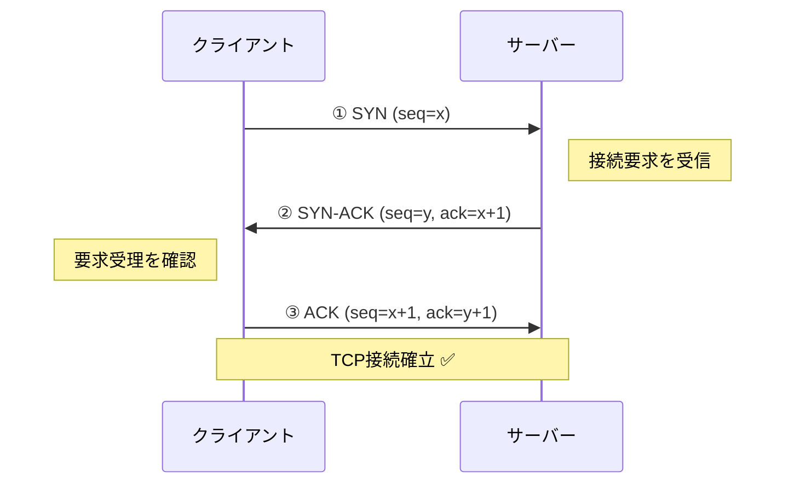
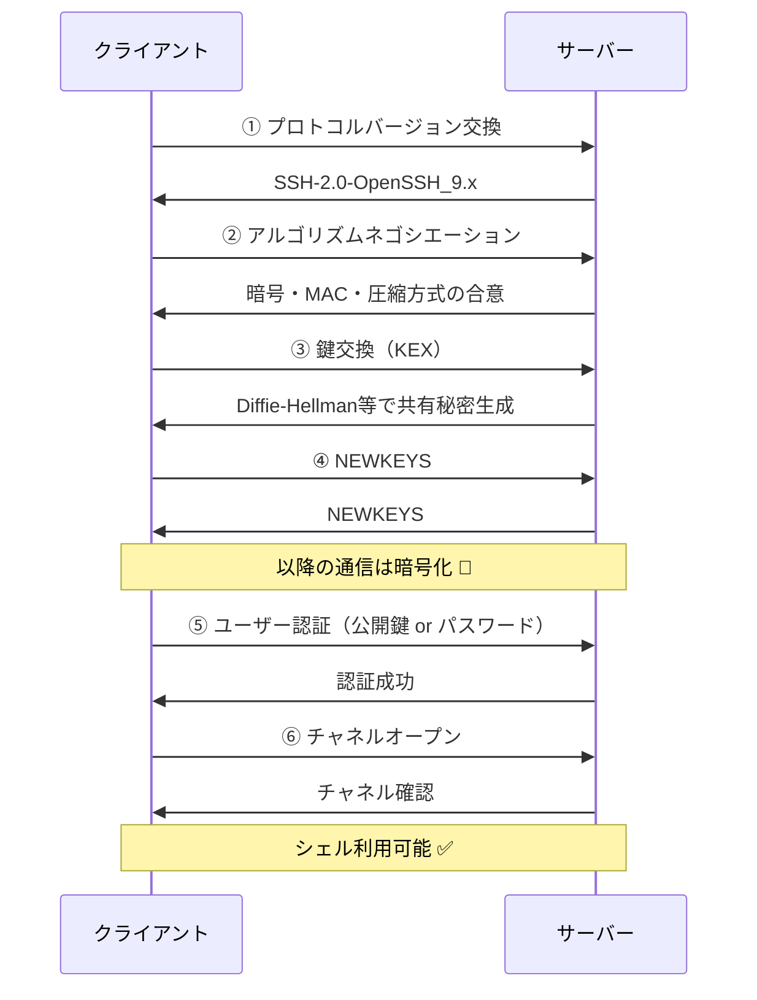
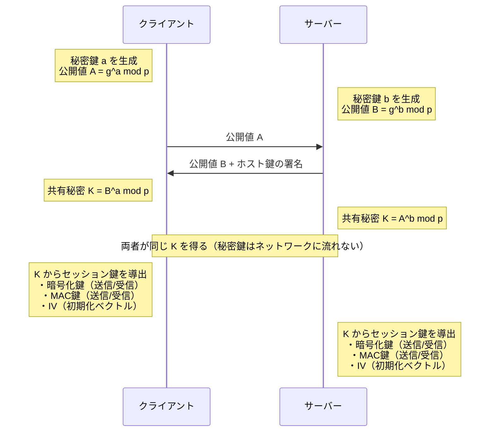
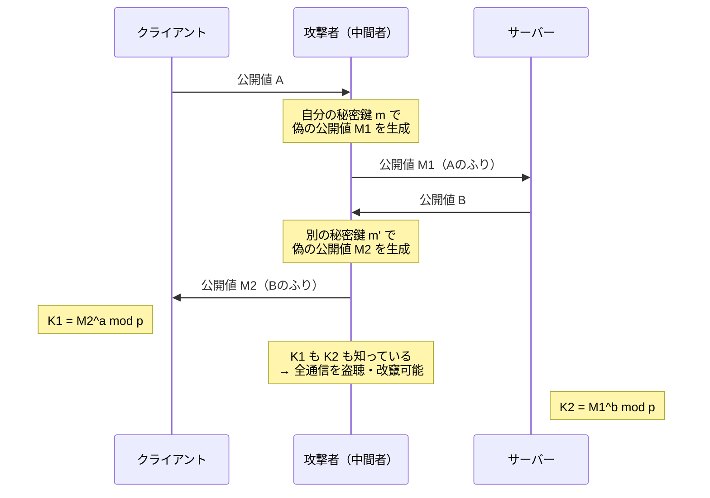
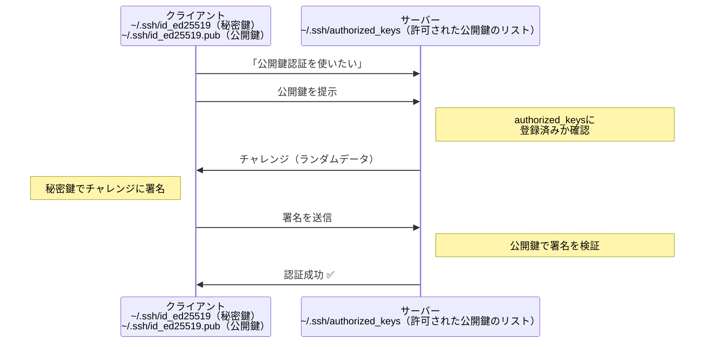

# SSHプロトコルを理解する — 仕組みから学ぶセキュア通信の基礎

リモートサーバーに安全に接続するSSH。毎日のように使っていても、その内部で何が起きているかを意識する機会は少ないかもしれません。

この記事では、SSHの土台であるTCPの仕組みから、鍵交換、暗号化、公開鍵認証まで、SSHプロトコルの全体像を掘り下げます。プロトコルの仕組みを理解すると、「なぜSSHはモバイル環境で切れやすいのか」「なぜMoshのような代替プロトコルが必要なのか」が腑に落ちるようになります。

## TCP — SSHの土台

SSHはトランスポート層にTCP（Transmission Control Protocol）を使います。TCPの接続確立は **3-way handshake** から始まります。



各ステップの役割を整理します：

| ステップ | パケット | 役割 |
|----------|----------|------|
| ① **SYN** | クライアント → サーバー | 「接続したい」という要求。クライアントの初期シーケンス番号（ISN: x）を通知する。このシーケンス番号は以降のデータの順序管理に使われる |
| ② **SYN-ACK** | サーバー → クライアント | SYNに対する応答（ACK）と、サーバー自身の接続要求（SYN）を**1パケットにまとめて**返す。サーバーの初期シーケンス番号（ISN: y）を通知しつつ、`ack=x+1` でクライアントのSYNを受理したことを伝える |
| ③ **ACK** | クライアント → サーバー | サーバーのSYNに対する応答。`ack=y+1` でサーバーのシーケンス番号を確認。これで**双方向の通信路が確立**する |

SYN-ACKが2つの意味を兼ねている点が重要です。「あなたのSYNを受け取った（ACK）」と「私もあなたと接続したい（SYN）」を同時に伝えることで、4ステップではなく3ステップでハンドシェイクが完了します。

### シーケンス番号（seq）とACK番号（ack）の使われ方

`ack=x+1` の「+1」は、「xまで受け取ったので、次は x+1 から送ってくれ」という意味です。ACK番号は常に**次に受け取りたいバイトの位置**を指します。

ハンドシェイク完了後、実際のデータ送受信ではこのシーケンス番号がバイト単位のカウンタとして機能します：

```
クライアント → サーバー: 500バイト送信 (seq=x+1)
サーバー → クライアント: ACK (ack=x+501)  ← "x+501番目から送って"

サーバー → クライアント: 200バイト送信 (seq=y+1)
クライアント → サーバー: ACK (ack=y+201)  ← "y+201番目から送って"
```

このシーケンス番号の仕組みにより、TCPは以下を実現しています：

- **順序保証**: パケットが順番通りに届かなくても、シーケンス番号で正しい順序に並べ直せる
- **欠損検知**: ACKが返ってこないシーケンス番号があれば、そのデータが届いていないとわかる → 再送する
- **重複排除**: 同じシーケンス番号のデータが2回届いても、2回目を捨てられる

裏を返せば、このシーケンス番号による厳密な順序管理が、TCPの「切れやすさ」の原因でもあります。パケットが1つ欠損するだけで、後続の全パケットがバッファで待たされる（**Head-of-Line Blocking**）ため、不安定なネットワークでは遅延が雪だるま式に増大します。

この3ステップを経て初めてデータ送受信が可能になります。TCPは以降も全データに対してACK（確認応答）を要求し、届かなければ再送します。信頼性は高いですが、このステートフルな仕組みが「接続」という概念を生み出しており、IPアドレスが変わると接続そのものが無効になります。

TCPの接続は **4タプル（送信元IP、送信元ポート、宛先IP、宛先ポート）** で識別されます。このうちどれか一つでも変わると、それは「別の接続」として扱われます。Wi-Fiからモバイル回線に切り替わるとクライアントのIPアドレスが変わるため、既存のTCP接続は維持できません。

## SSHハンドシェイク — 接続確立の全体像

TCP接続が確立した上で、SSHプロトコル自体のハンドシェイクが始まります。



①②はSSHバージョンと使用アルゴリズム（暗号方式、MAC方式、圧縮方式）を互いに通知して合意する手続きで、⑥はシェルセッションを開始するための制御メッセージです。これらは定型的なやりとりなので、以降では **③鍵交換**、**④暗号化の仕組み**、**⑤公開鍵認証** を詳しく見ていきます。

## ③ 鍵交換（Key Exchange）

SSHの鍵交換はDiffie-Hellman系のアルゴリズムで行われます。現在主流なのは `curve25519-sha256` です。



秘密鍵 a, b はそれぞれの側でランダムに生成されます。現在主流の `curve25519-sha256` では、OSの暗号論的乱数生成器（`/dev/urandom` 等）から32バイト（256ビット）のランダム値を取得し、それを秘密鍵として使います。接続のたびに新しいランダム値が生成されるため、仮にある接続の秘密鍵が漏洩しても過去や未来の接続には影響しません（**前方秘匿性 / Forward Secrecy**）。

ポイントは、この秘密鍵（a, b）は一切ネットワーク上を流れないこと。たとえ通信を傍受されても、共有秘密Kを逆算することは計算量的に不可能（離散対数問題）です。

### なぜ両者のKは同じ値になるのか

数学的にはたった2行で証明できます。

```
クライアントが計算する K = B^a = (g^b)^a = g^(ba)  mod p
サーバーが計算する   K = A^b = (g^a)^b = g^(ab)  mod p
```

$g^{ba} = g^{ab}$ なので、両者は必ず同じ値になります。

### ホスト鍵の署名 — なぜ必要なのか

鍵交換の図で、サーバーは公開値 B と一緒に**ホスト鍵の署名**を送っています。これはDiffie-Hellman単体の弱点を補うためです。

DH鍵交換だけでは、クライアントは「公開値 B を送ってきた相手が本物のサーバーかどうか」を確認できません。攻撃者が通信を中継して、クライアントとサーバーそれぞれに別の公開値を渡せば、双方と別々の共有秘密を確立できてしまいます（**中間者攻撃 / MITM**）。



これを防ぐために、サーバーはDH公開値 B を送る際に、サーバーの**ホスト鍵**（`/etc/ssh/ssh_host_ed25519_key` 等）で署名を付けます。クライアントは `~/.ssh/known_hosts` に保存されたサーバーの公開鍵で署名を検証し、相手が本物のサーバーであることを確認します。

初めてサーバーに接続したときに表示されるこのメッセージは、まさにホスト鍵を信頼するかどうかの確認です：

```
The authenticity of host 'example.com' can't be established.
ED25519 key fingerprint is SHA256:xxxxx.
Are you sure you want to continue connecting (yes/no)?
```

ここで `yes` と答えると、そのホスト鍵が `known_hosts` に保存され、以降の接続では自動的に検証されます。もしサーバーのホスト鍵が変わっていた場合（＝中間者攻撃の可能性）、SSHは `WARNING: REMOTE HOST IDENTIFICATION HAS CHANGED!` と警告を出して接続を拒否します。

## ④ SSH暗号化の仕組み

鍵交換が完了し、両者がNEWKEYSメッセージを交換すると、以降の全通信は暗号化されます。ただし、共有秘密 K を直接暗号化に使うわけではありません。K とハンドシェイク中のやりとりのハッシュ値を組み合わせて、**用途別のセッション鍵**を導出します：

```
K + ハッシュ値 → 暗号化鍵（クライアント→サーバー）
                → 暗号化鍵（サーバー→クライアント）
                → MAC鍵（クライアント→サーバー）
                → MAC鍵（サーバー→クライアント）
                → IV（初期化ベクトル、各方向）
```

送信方向ごとに異なる鍵を使いますが、K とハッシュ値は両者で同じなので、**導出される鍵はすべて両側で同一のセットが生成されます**。つまり、クライアントもサーバーも全ての鍵を持っており、「どの鍵をどの方向で使うか」のルールだけが決まっています。

```
クライアント → サーバー: クライアントが鍵Aで暗号化 → サーバーが鍵Aで復号
サーバー → クライアント: サーバーが鍵Bで暗号化 → クライアントが鍵Bで復号
```

方向ごとに鍵を分けることで、一方の鍵が漏洩しても逆方向の通信は保護されます。

### 旧方式（暗号化 + MAC 分離）

従来の `aes256-ctr` + `hmac-sha2-256` のような方式では、暗号化と改竄検知が別々のアルゴリズムで行われます。

| SSHパケット（旧方式） | サイズ | 備考 |
|----------------------|--------|------|
| パケット長 | 4 bytes | |
| パディング長 | 1 byte | |
| ペイロード | 可変長 | 実際のデータ |
| パディング | 4〜255 bytes | |
| **MAC（メッセージ認証コード）** | 可変長 | パケットが改竄されていないことを検証 |

暗号化とMAC計算が独立した処理であるため、この2つを**どの順序で組み合わせるか**に選択肢が生まれます。

```
① Encrypt-and-MAC:   平文を暗号化、平文からMAC計算 → 両方送信
② MAC-then-Encrypt:  平文からMAC計算、平文+MACをまとめて暗号化
③ Encrypt-then-MAC:  平文を暗号化、暗号文からMAC計算 → 両方送信
```

各方式の安全性は大きく異なります。

**①が脆弱な理由**: MACが平文から計算され、暗号化されずにそのまま送信されるため、MAC自体が平文の情報を漏らす可能性があります。さらに、受信側はMAC検証に復号後の平文が必要なため、復号とパディング検証がMAC検証より先に走ります。

**②が脆弱な理由**: 平文+MACをまとめて暗号化するため、MACが外部に露出する問題は解消されます。しかし受信側はMAC検証のためにまず復号が必要で、①と同じ処理順序の問題が残ります。TLS/SSLがこの方式を採用しており、POODLE攻撃などの標的になりました。

**③が安全な理由**: 暗号文からMACを計算するため、受信側は**復号する前に**MACを検証できます。改竄された暗号文はMAC検証の時点で拒否され、復号やパディング検証に到達しません。OpenSSHでも後から `*-etm@openssh.com` 拡張として追加されました。ただし、暗号化とMACが別アルゴリズムのままなので、2つの鍵管理・2つの処理パスが必要という複雑さは残ります。

SSHは①の方式を採用していました。MACは平文から計算されるため、検証するには復号後の平文が必要です。結果として受信側の処理順序は：

```
受信 → まず復号 → パディング検証 → MAC検証
```

ここに問題があります。**MACを検証する前に復号とパディング検証が走る**ため、パディング検証の結果が外部から観測可能になります。これが**パディングオラクル攻撃**の原因です。攻撃者は細工した暗号文をサーバーに送り、パディング検証の応答差異（タイミング差やエラー種別）を繰り返し観測することで、**暗号鍵を知らなくても暗号文を1バイトずつ解読できます**。16バイトブロックなら最大4,096回の試行で全バイトが解読可能であり、SSHでは実際にCVE-2008-5161として報告されました。

攻撃の詳しい仕組み（CBCモード、XOR演算、PKCS#7パディングの基礎から具体的な攻撃手順まで）は別記事で解説しています：

👉 [パディングオラクル攻撃を理解する — 暗号鍵なしで暗号文を解読する手法](padding-oracle-article.md)

つまり、暗号化とMACが独立しているということは、「組み合わせ方を間違えると脆弱になる」という実装者への罠が存在するということです。

### 現在の主流 — AEAD方式

現在のOpenSSHで優先されるのは `chacha20-poly1305` や `aes256-gcm` などのAEAD（Authenticated Encryption with Associated Data）方式です。

| SSHパケット（AEAD方式） | サイズ | 備考 |
|------------------------|--------|------|
| パケット長 | 4 bytes | 別鍵で暗号化（`chacha20-poly1305` の場合） |
| パディング長 | 1 byte | |
| ペイロード | 可変長 | 実際のデータ |
| パディング | 4〜255 bytes | |
| **認証タグ** | 16 bytes | 暗号化と同時に生成。MACの代わり |

「暗号化とMACを1つにまとめただけでは？」と思うかもしれませんが、AEADは内部の数学的構造が根本的に異なります。

#### なぜAEADなら脆弱性が生まれないのか

**① 認証タグが暗号化の副産物として生成される**

たとえばOCBモードでは、各平文ブロックをAES暗号化する際の中間計算結果をXOR蓄積し、最終的に認証タグを導出します。暗号化の過程そのものが認証タグを生み出す構造であり、「暗号化だけして認証しない」「認証だけして復号しない」という分離が原理的にできません。

**② 復号時に認証前の中間状態が漏れない**

旧方式の脆弱性は「復号 → パディング確認 → MAC確認」という**段階的な処理**で中間結果が漏れることでした。AEADでは復号と認証が同時に実行され、認証タグが合わなければ**一切の中間結果を返しません**。「パディングが正しかったか」「どのバイトまで合っていたか」といった情報が漏れる経路がそもそも存在しないため、パディングオラクル攻撃は成立しません。

**③ 合成順序の選択肢そのものが存在しない**

旧方式では①②③の組み合わせを実装者が選ぶ必要があり、③（Encrypt-then-MAC）以外を選ぶと脆弱になるという罠がありました。AEADは暗号化と認証が不可分な単一プリミティブなので、「組み合わせ方を間違える」という自由度そのものが排除されています。

## ⑤ SSH公開鍵認証

暗号化が確立した上で、ユーザー認証が行われます。パスワード認証より安全な公開鍵認証の流れ：

**事前準備（ハンドシェイクとは別。初回のみ手動で行う）：**

1. クライアント側で `ssh-keygen` を実行し、秘密鍵と公開鍵のペアを生成
2. 公開鍵をサーバーの `~/.ssh/authorized_keys` に登録（`ssh-copy-id` コマンド等で転送）

この準備が済んでいる前提で、接続のたびに以下の認証が行われます：



秘密鍵がネットワーク上を流れることは一切ありません。サーバーは公開鍵で署名を検証するだけです。秘密鍵と公開鍵はペアで生成され、秘密鍵で作った署名は対応する公開鍵でしか検証できません。つまり「秘密鍵を持っていることの証明」だけが送られる仕組みです。

## まとめ

SSHは、TCP上にセキュアな通信路を構築するための洗練されたプロトコルです。

- **TCP 3-way handshake** で信頼性のある接続を確立
- **Diffie-Hellman鍵交換** でネットワーク上に秘密鍵を流さずに共有秘密を生成
- **ホスト鍵の署名** で中間者攻撃を防止
- **AEAD暗号化** で暗号化と認証を一体化し、脆弱性の余地を排除
- **公開鍵認証** でパスワードに依存しないセキュアな認証を実現

しかし、SSHにはTCPベースであるが故の弱点もあります。IPアドレスの変化で接続が切れる、パケットロスでストリーム全体がブロックされるなど、**モバイル環境では致命的な問題**を抱えています。

次の記事では、これらの課題を根本的に解決する **Moshプロトコル** の仕組みを解説します。

👉 [Moshプロトコルを理解する — モバイル時代のリモートターミナル](mosh-protocol-article.md)
